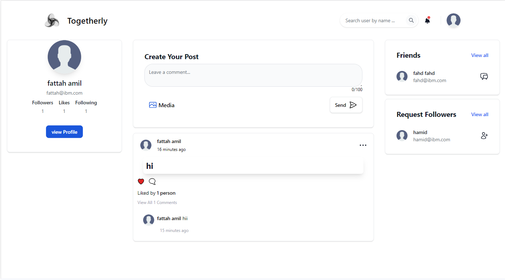
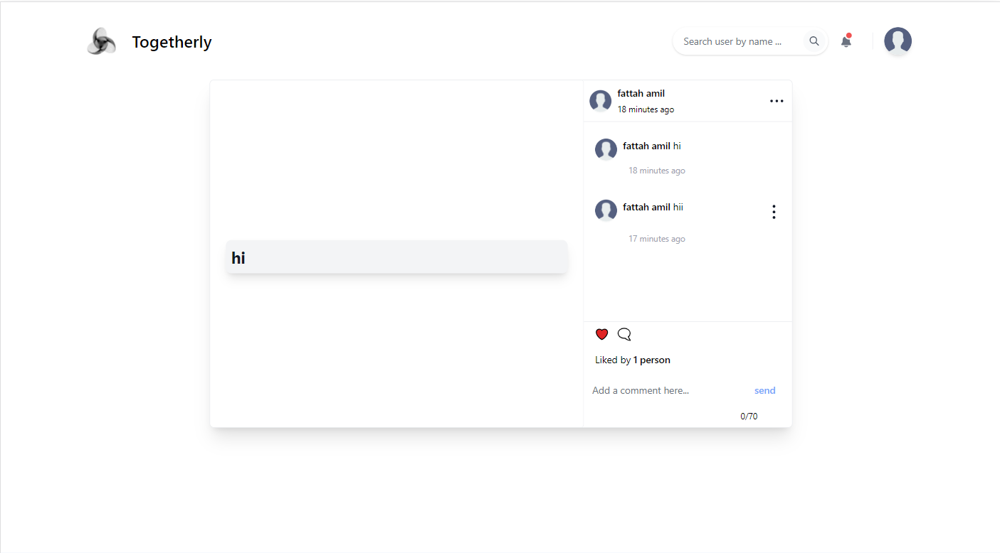
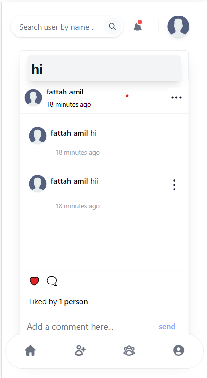
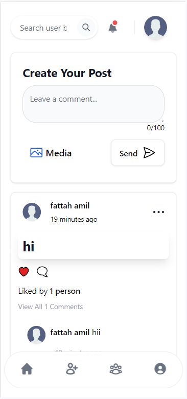
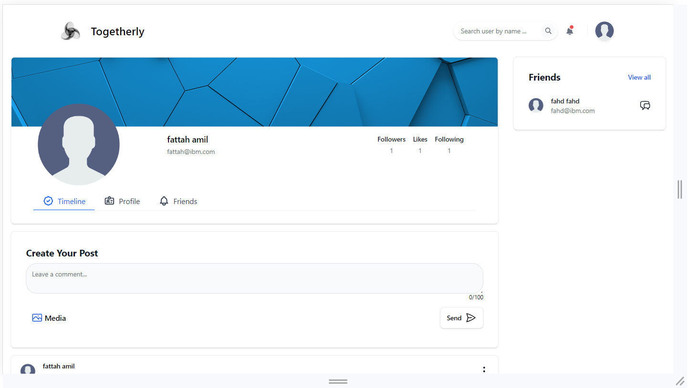
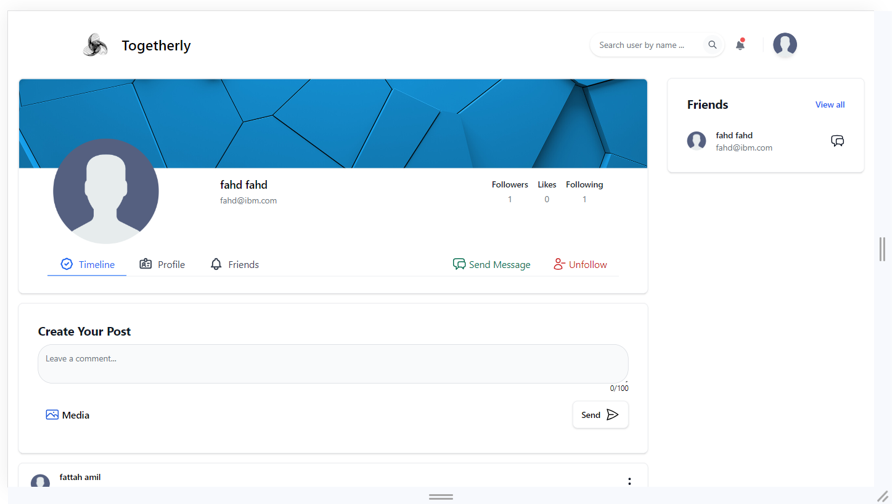
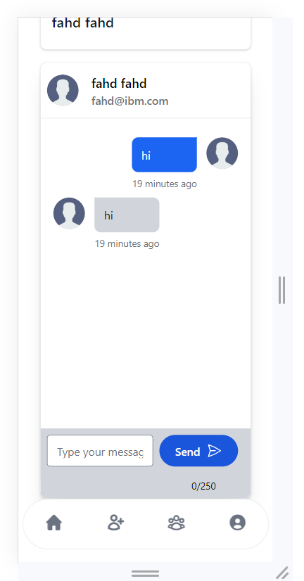
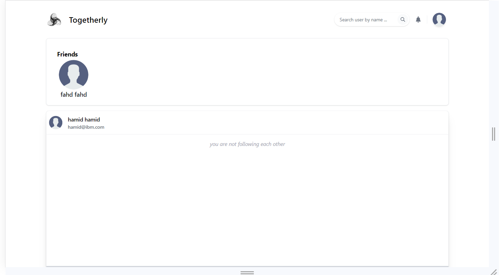
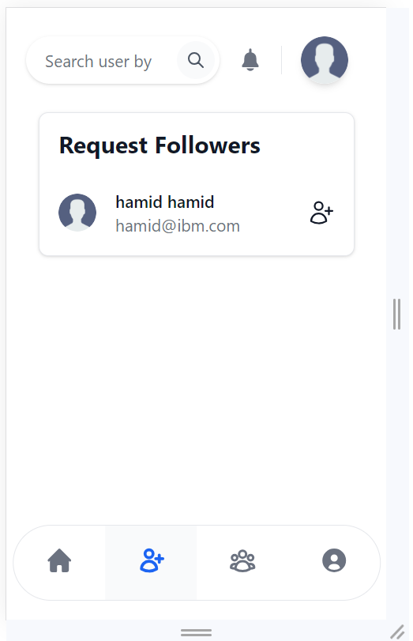

# Togetherly

This is a Togetherly project built with Spring Boot (backend) and Angular (frontend). It allows users to register, log in, share posts, like and comment on posts, follow other users, receive notifications, and chat with their friends using web sockets.

## Features

- **User Authentication**: Users can register and log in using JWT (JSON Web Tokens) for authentication.

- **Role-Based Access Control**:
  - Admin: Can manage users, change user roles, and perform administrative actions.
  - Teacher: Can share posts, comment on posts, and manage their own profile.
  - Student: Can comment on posts, manage their own profile, and follow other users.

- **User Profile Management**: Users can update their profile information, including name, profile picture, and password.

- **Post Sharing**: Teachers can share posts, and all users can like and unlike posts.

- **Comments**: Users can add comments to posts and delete their own comments.

- **Following System**: Users can follow/unfollow other users, and when mutual following occurs, they become friends and can chat.

- **Notifications**: Users receive notifications for various activities, including likes, comments, and new chat messages.

- **Real-time Chat**: Users can chat with their friends in real-time using web sockets.

## Images

























## Installation

### Backend (Spring Boot)

1. Clone the repository:

   ```bash
   git clone 'https://github.com/FattahAmil/Togetherly.git'
   ```

2. Open the `backend` directory:

   ```bash
   cd Back-end
   ```

3. Configure the application.properties file with your database settings, JWT secret, and other necessary configurations.

4. Run the Spring Boot application:

   ```bash
   ./mvnw spring-boot:run
   ```

### Frontend (Angular)

1. Open the `frontend` directory:

   ```bash
   cd Front-end
   ```

2. Install dependencies:

   ```bash
   npm install
   ```

3. Start the Angular application:

   ```bash
   ng serve
   ```

## Usage

1. Register an account or log in.

2. Explore Togetherly:
   - Share posts, like posts, and comment on posts.
   - Follow other users and chat with friends.
   - Receive notifications for activity on your Togetherly account.


## Acknowledgments

- Special thanks to Spring Boot and Angular communities for their amazing resources and documentation.

## Contact

For any questions or inquiries, please contact fattah.ptech2020@gmail.com.
